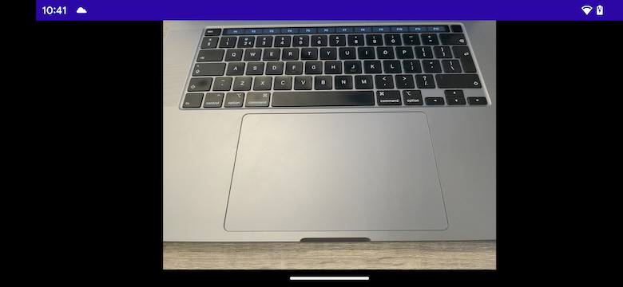

# CameraX screen rotation issue

When keeping the activity on orientation changes, sometimes the camera preview gets confused about the aspect ratio of the preview frames.

To reproduce:
1. Enable auto-rotate on the phone and start the sample app
2. Rotate the phone between portrait and landscape repeatedly until the view bugs out

Expected for landscape:

Actual - sometimes on certain phones:

Reproducible on phones:
- Pixel 5 - Android 14 beta
- Pixel 6a - Android 13

Tested and not reproducible on phones:
- Pixel 4 - Android 13
- Pixel 3 - Android 12
- Samsung Fold - Android 13
- Samsung S22 - Android 13
